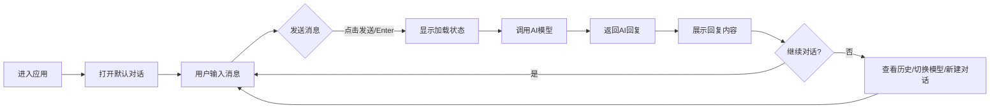

# Azpa AI对话软件 - 产品需求文档

## 1. Product Overview
Azpa是一款现代化网页端AI对话软件，致力于为用户提供直观、流畅的智能对话体验。产品集成多模型支持，具备完善的对话管理功能，满足用户在不同场景下的AI交互需求。

## 2. Core Features

### 2.1 User Roles
| Role | Registration Method | Core Permissions |
|------|---------------------|------------------|
| Normal User |无需注册|使用对话功能、管理对话历史、切换AI模型|

### 2.2 Feature Module
1. **对话界面**: 消息展示区域、用户输入区域、发送按钮、消息状态提示
2. **模型选择**: 模型列表、当前模型标识、模型信息展示
3. **对话管理**: 对话历史列表、加载历史对话、清空对话、删除对话
4. **交互功能**: 发送/取消发送、复制消息、键盘快捷键

### 2.3 Page Details
| Page Name | Module Name | Feature description |
|-----------|-------------|---------------------|
| 主对话页面 | 消息展示区 | 区分用户/AI消息，支持文本格式化，滚动加载历史 |
| 主对话页面 | 输入区域 | 文本输入框、发送按钮、取消发送按钮 |
| 主对话页面 | 侧边栏 | 对话历史列表、新建对话、模型选择 |
| 主对话页面 | 模型选择 | 模型列表展示、模型特性简介、切换模型 |

## 3. Core Process
用户进入应用后，默认打开新对话。用户输入问题后点击发送或按Enter键，系统显示加载状态并调用AI模型，返回结果后展示回复。用户可随时切换模型、查看历史对话或新建对话。

## 4. User Interface Design

### 4.1 Design Style
- **主色调**: 深蓝色(#1e3a5f)搭配青色(#00d4ff)作为强调色
- **背景**: 深色背景(#0a1628)，营造专业科技感
- **按钮风格**: 圆角矩形，渐变效果，悬停时亮度变化
- **字体**: 使用JetBrains Mono作为主字体，现代等宽字体，适合代码展示
- **布局**: 左侧侧边栏 + 右侧主对话区域的经典布局
- **图标**: 使用lucide-react图标库，简洁现代风格

### 4.2 Page Design Overview
| Page Name | Module Name | UI Elements |
|-----------|-------------|-------------|
| 主对话页面 | 侧边栏 | 品牌Logo、新建对话按钮、对话历史列表、模型选择器 |
| 主对话页面 | 消息区 | 用户消息气泡(右侧)、AI消息气泡(左侧)、加载动画、时间戳 |
| 主对话页面 | 输入区 | 多行输入框、发送按钮、取消按钮、快捷键提示 |

### 4.3 Responsiveness
- **桌面端(>1200px)**: 完整布局，侧边栏固定宽度320px
- **平板端(768px-1200px)**: 侧边栏可折叠，响应式宽度调整
- **移动端(<768px)**: 侧边栏转为抽屉式菜单，输入区适配触控操作

### 4.4 Animation Effects
- 消息发送时的淡入动画
- AI回复的打字机效果
- 加载状态的脉冲动画
- 侧边栏展开/收起过渡效果
- 按钮悬停微动画