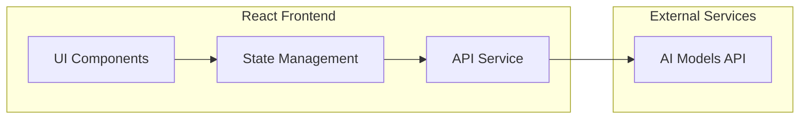
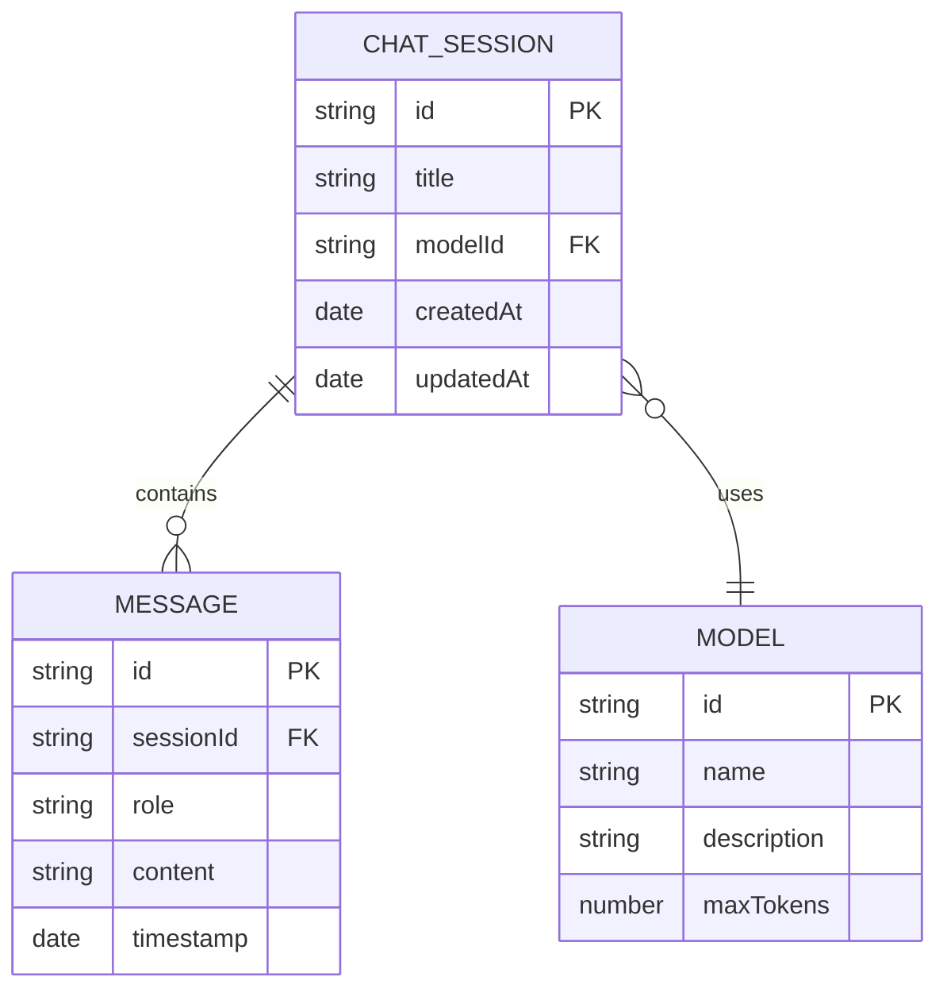

# Azpa AI对话软件 - 技术架构文档

## 1. Architecture Design


## 2. Technology Description
- **Frontend**: React@18 + TypeScript + TailwindCSS@3 + Vite
- **State Management**: Zustand
- **Routing**: React Router DOM
- **Icons**: Lucide React
- **Markdown Rendering**: react-markdown + remark-gfm
- **Initialization Tool**: vite-init (react-ts template)

## 3. Route Definitions
| Route | Purpose |
|-------|---------|
| / | 主对话页面，展示当前对话 |
| /chat/:id | 加载指定ID的历史对话 |

## 4. API Definitions

### 4.1 Model API
```typescript
interface AIModel {
  id: string;
  name: string;
  description: string;
  maxTokens: number;
  icon: string;
}

interface Message {
  id: string;
  role: 'user' | 'assistant';
  content: string;
  timestamp: Date;
}

interface ChatSession {
  id: string;
  title: string;
  modelId: string;
  messages: Message[];
  createdAt: Date;
  updatedAt: Date;
}
```

### 4.2 Mock API Service
由于无后端，使用mock数据模拟AI回复：
- GET /api/models - 获取可用模型列表
- POST /api/chat - 发送消息并获取AI回复(模拟延迟)

## 5. Data Model

### 5.1 Data Model Definition


### 5.2 Storage Strategy
- 使用LocalStorage存储对话历史
- 存储结构: `azpa_chats` -> ChatSession[]

## 6. Project Structure
```
src/
├── components/
│   ├── Sidebar/
│   │   ├── index.tsx
│   │   ├── ChatList.tsx
│   │   └── ModelSelector.tsx
│   ├── Chat/
│   │   ├── index.tsx
│   │   ├── MessageBubble.tsx
│   │   ├── MessageList.tsx
│   │   └── InputArea.tsx
│   └── common/
│       ├── LoadingIndicator.tsx
│       └── EmptyState.tsx
├── store/
│   └── chatStore.ts
├── services/
│   └── aiService.ts
├── utils/
│   └── storage.ts
├── types/
│   └── index.ts
├── App.tsx
├── main.tsx
└── index.css
```

## 7. Key Features Implementation

### 7.1 多轮对话上下文
- 每次发送消息时携带完整对话历史
- AI回复时自动追加到消息列表
- 支持从历史对话继续

### 7.2 模型切换
- 侧边栏展示可用模型
- 当前选中模型高亮显示
- 切换后不影响当前对话历史

### 7.3 消息状态管理
- 发送中显示加载动画
- 支持取消发送(仅在加载中)
- 发送完成后显示时间戳

### 7.4 快捷键支持
- Enter: 发送消息(Shift+Enter换行)
- Esc: 取消发送/清空输入
- Ctrl+Enter: 强制发送

### 7.5 响应式布局
- 使用Tailwind的响应式断点
- 移动端侧边栏转为抽屉